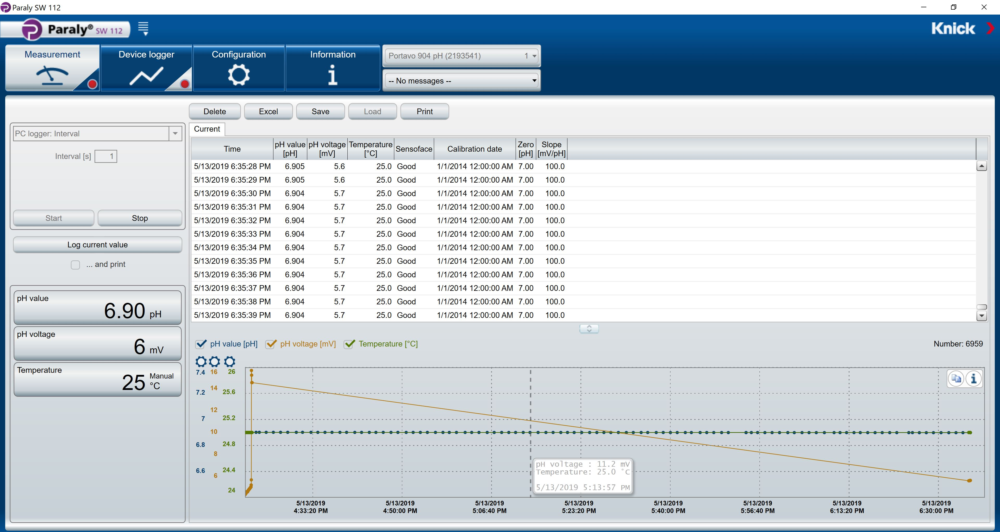
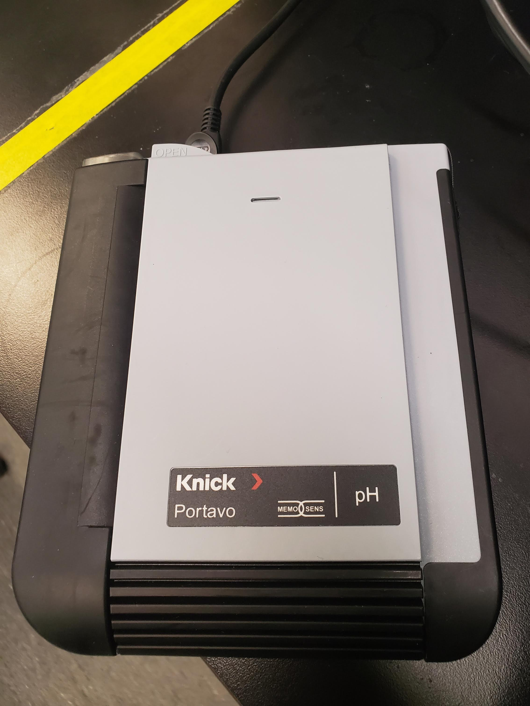

# ph-monitor
This program talk to a `Knick Protavo 904` ph meter and `Hei_FLOW Precision 01` pumps. Depending on the hp value read from the ph meter, the pump flow is controlled. The program is capable of controlling
multiple pumps.

## `Knick Protavo 904` ph meter setup
Download and install application called `Paraly SW 112` using [this](https://www.knick-international.com/en/products/portables/portavo/portavo-904/index.html) link.

This is how the application looks like

Image of `Knick Protavo 904` ph meter 

Note: this project is not maintained. If the link does not work, just google `Knick Protavo 904`.

## Install Anaconda

## setup environment (optional)

## 